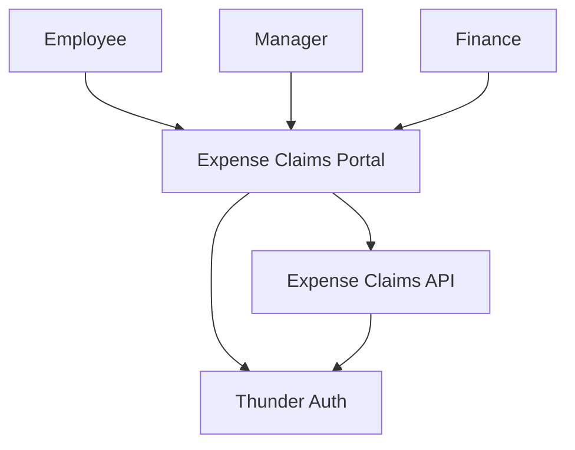
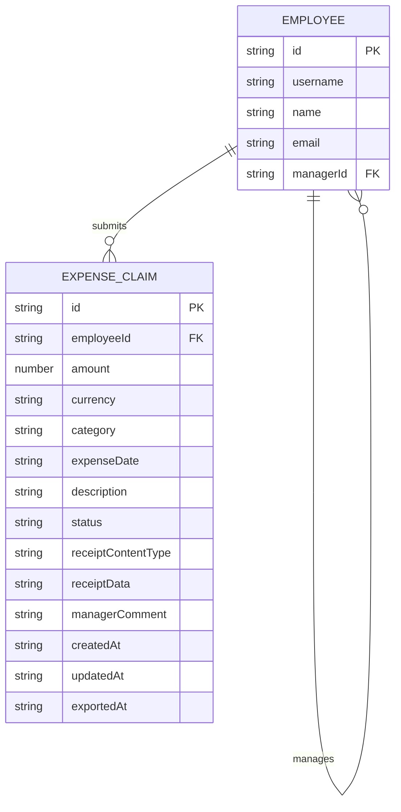
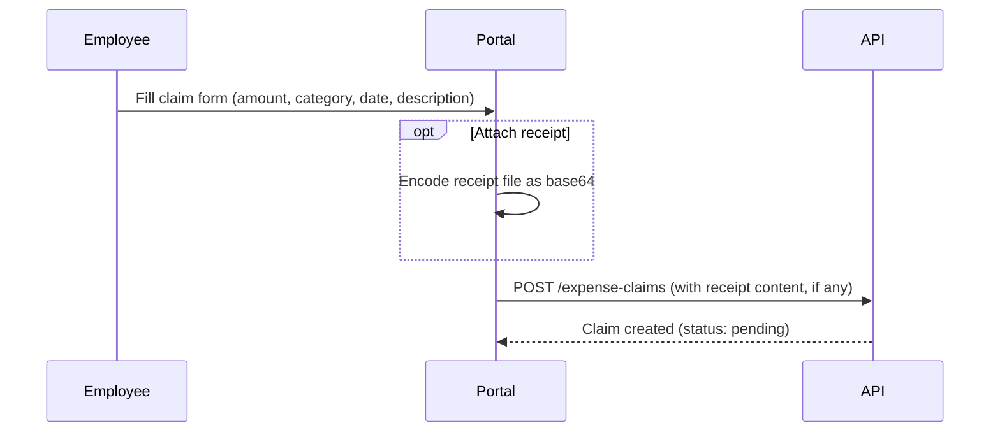
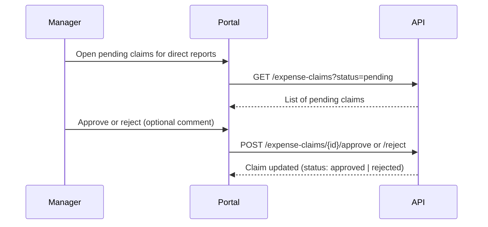
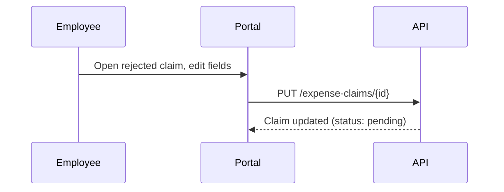
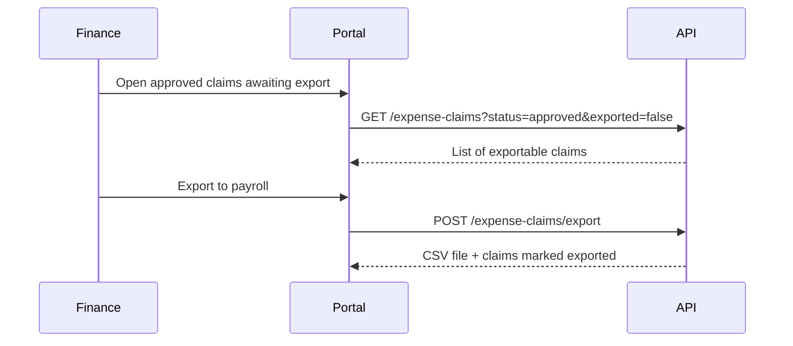

# Expense Claims — Design

## Overview

Employees submit expense claims through the Expense Claims Portal; each claim
routes to the employee's direct manager for approval or rejection; a rejected
claim is edited and resubmitted by the same employee; and finance exports
approved, unexported claims to a CSV file for payroll. The portal and its API
sign users in through Thunder, resolve the caller's role from their group
membership, and scope every view to that role. Receipts are optional
image/file attachments stored inline on the claim record itself, in the API's
own database, which also holds the lightweight employee/manager directory
this project needs (no existing organization directory service is registered
to consume instead).

## Context (C1)

## Domain model (ER)

`status` is one of `pending`, `approved`, `rejected`. `receiptData` is the
optional receipt file, stored inline as base64 content alongside
`receiptContentType`; both are nullable. `exportedAt` is null until finance
exports the claim, and export only ever includes `approved` claims with
`exportedAt` still null.

## Key flows

### Submit a claim

### Manager approves or rejects

### Employee edits and resubmits a rejected claim

### Finance exports approved claims

